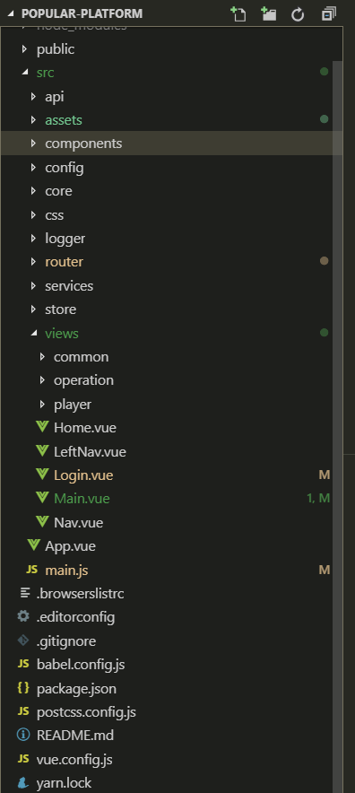
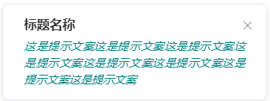
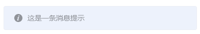
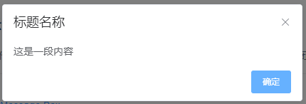
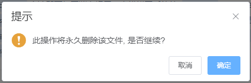
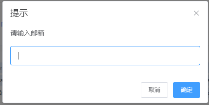
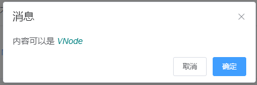

# 开发规范和说明文档

## 安装说明

### 安装

`npm install`

或

`yarn`

### 编译开发

`npm run serve`

或

`yarn run serve`

### 编辑生产

`npm run build`

或

`yarn run build`

## 工程目录结构




### polular-platform

- public				// 不经过`webpack`打包的资源
- src					// 源文件
    - api					// 后端接口配置文件
    - assets				// 不经过`webpack`打包的资源
    - components			// 公共`vue`组件目录
    - config				// 可提取的配置文件
    - core				// api接口核心文件
    - logger				// 日志类
    - router				// `vue router`配置
    - services			// 调用后端接口的逻辑层
    - store				// `vuex`配置
    - views				// `vue`单文件视图组件目录
	- .browserslistrc		// 浏览器兼容配置列表
- babel.config.js		// babel配置文件
- package.json		// 依赖配置
- vue.config.js		// `vue`配置文件


## 模块划分

统一模块名，按模块分离时使用如下模块名：

|模块|说明|
|-|-|
|player.js|玩家|
|funds.js|资金|
|operation.js|运营|
|anglyze.js|分析|
|statistics.js|统计|
|content.js|内容|
|system.js|系统|

## vue router 配置

按模块名分离路由配置文件

```javascript
// 必须导入主视图
import MainView from '@/views/Main.vue';
// 公司入款账户组件
import PayAccountView from '@/views/operation/PayAccount.vue';


export default [
	{
		path: '/operation',
		component: MainView,
		children: [
			{
				path: '',
				redirect: 'payaccount/',
			},
			{
				name: 'payaccount',
				path: 'payaccount/',
				component: PayAccountView,
			}，
            // ...
		]
	}
];
```

其中，导出的路由配置中`children`子路由的`path`必须以 **`/`** 结尾。


## 首页顶部菜单配置

`src/congig/menus.js`是顶部菜单配置文件，需要修改菜单跳转的路径或菜单名称，在此修改。


## 接口调用说明

>  以登录模块举例说明

在`src/api`目录下，创建对应模块的`api`文件，定义并导出接口路径

如登录模块，就在 `src/api` 目录下新建 `login.js` ，然后导出模块

```javascript
export const login = 'login';
```

或者：

```javascript
export const login = {
	url: 'login'
};
```


然后在`src/services`目录下新建登录模块接口调用文件 `login.js` ，编写调用方法并导出


```javascript
// 导入接口核心模块
import { get, post, put, del, patch } from "@/core";

/**
 * 登录接口
 * @param Object params 登录需要提交的数据
 * @return 返回登录校验后的结果
 */
export async function toLogin(params){
	return post('login.login', params);
}
```


`src/core/`会导出五个方法：

- get
- post
- put
- del
- patch

分别对应`get`、`post`、`put`、`delete`和`patch`的http请求方式


然后在视图层调用`toLogin`方法，视图层不编写`http请求`相关的代码，只调用`services`层对外暴露的方法，在`services`层进行`http`请求，并进行数据处理

如：

Login.vue


```javascript
import { toLogin } from '@/services/login'

export default {
    data(){
        return {
            login: {
                username: 'disanfang4',
                password: '123456xyz',
                code: '123456'
            }
        }
    },
    methods: {
        async toLogin(){
            const { token } = await toLogin(this.login);
            sessionStorage.token = token;

            // 跳转到首页
            this.$router.push('/');
        }
    }
}
```


## UI框架

UI框架使用的`element-ui`，目前已经引入了部分模块，如果需要继续引入其他模块，在根目录 `main.js` 中进行添加引入，如：需要引入 Button 组件

```javascript
import Vue from 'vue'

import {
	Button,
} from 'element-ui';

Vue.use(Button);
```

目前已经引入的公共组件：


### Notification



在`Vue`组件中调用方式：

```javascript
this.$notify({
    title: '提示',
    message: '这是一条不会自动关闭的消息',
});
```

具体可选参数参见 [element-ui官网]( https://element.eleme.cn/#/zh-CN/component/notification)


### Message



在`Vue`组件中调用方式：

```javascript
this.$message('这是一条消息提示');
```

具体可选参数参见 [element-ui官网]( https://element.eleme.cn/#/zh-CN/component/message)


## MessageBox

### $alert 消息提示



在`Vue`组件中调用方式：

```javascript
this.$alert('这是一段内容', '标题名称', {
    confirmButtonText: '确定',
    callback: action => {
        this.$message({
            type: 'info',
            message: `action: ${ action }`
        });
    }
});
```

### $confirm 确认信息



在`Vue`组件中调用方式：

```javascript
this.$confirm('此操作将永久删除该文件, 是否继续?', '提示', {
    confirmButtonText: '确定',
    cancelButtonText: '取消',
    type: 'warning'
}).then(() => {
    this.$message({
        type: 'success',
        message: '删除成功!'
    });
}).catch(() => {
    this.$message({
        type: 'info',
        message: '已取消删除'
    });          
});
```

### $prompt 询问



在`Vue`组件中调用方式：

```javascript
this.$prompt('请输入邮箱', '提示', {
    confirmButtonText: '确定',
    cancelButtonText: '取消',
    inputPattern: /[\w!#$%&'*+/=?^_`{|}~-]+(?:\.[\w!#$%&'*+/=?^_`{|}~-]+)*@(?:[\w](?:[\w-]*[\w])?\.)+[\w](?:[\w-]*[\w])?/,
    inputErrorMessage: '邮箱格式不正确'
}).then(({ value }) => {
    this.$message({
        type: 'success',
        message: '你的邮箱是: ' + value
    });
}).catch(() => {
    this.$message({
        type: 'info',
        message: '取消输入'
    });       
});
```

具体可选参数参见 [element-ui官网]( https://element.eleme.cn/#/zh-CN/component/message-box)

### $msgbox 自定义



在`Vue`组件中使用方式：

```javascript
const h = this.$createElement;
this.$msgbox({
    title: '消息',
    message: h('p', null, [
        h('span', null, '内容可以是 '),
        h('i', { style: 'color: teal' }, 'VNode')
    ]),
    showCancelButton: true,
    confirmButtonText: '确定',
    cancelButtonText: '取消',
    beforeClose: (action, instance, done) => {
        if (action === 'confirm') {
            instance.confirmButtonLoading = true;
            instance.confirmButtonText = '执行中...';
            setTimeout(() => {
                done();
                setTimeout(() => {
                    instance.confirmButtonLoading = false;
                }, 300);
            }, 3000);
        } else {
            done();
        }
    }
}).then(action => {
    this.$message({
        type: 'info',
        message: 'action: ' + action
    });
});
```


## 注意事项

> 1. 请不要私自引入其他依赖模块，如必须引入请沟通确认后在引入。
> 2. 请尽量不要修改他人负责的模块文件内容，如必需修改请沟通后在修改。